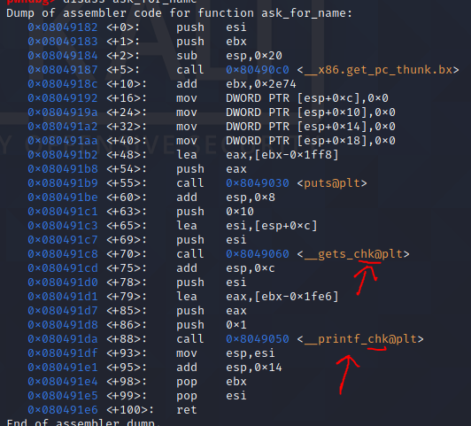
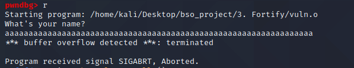
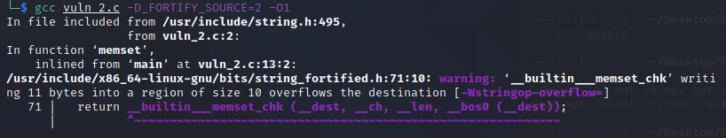
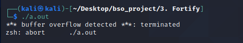
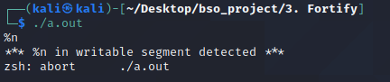
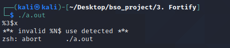

# Fortify source

### 1. Opis

Technika `fortify source` polega na wykrywaniu przepełnienia bufora w `libc`. 

`Fortify source` jest wywoływane flagą `-D_FORTIFY_SOURCE={1,2}` gdzie `1,2` oznacza poziom zabezpieczeń.

Flaga ta działa tylko jeżeli obecna jest też flaga `-O1` lub wyższa.

`Libc` zawiera funkcje, które są wrapperami na funkcje, które są niebezpieczne, ale przyjmującymi argument oznaczający długość bufora. Dla przykładu funkcja:

```c
__memcpy_chk(void * dest, const void * src, size_t len, size_t destlen)
```

Funkcje te nie powinny być wywoływane przez użytkownika, są one używane właśnie w `fortify source`. Kiedy kompilator nie jest w stanie ustalić, że funkcja nie posiada błędu, zamienia ją na jej bezpieczny odpowiednik.

Zapewnia to `run-time` protekcję przed przepełnieniem bufora.

Długość bufora obliczana jest za pomocą funkcji `__builtin_object_size()`, która zwraca bajty pozostające w strukturze. Jeżeli w czasie kompilacji nie znana jest wielkość to długością jest `(size_t) -1`.

Różnica pomiędzy poziomiomem 1 i 2 określa to jak liczone są pozostałe bajty w powyższej funkcji. Rozważmy dana strukturę:

```c
struct test
{
    char test1[5];
    char test2[5];
}
```

W tym przypadku zapisywanie do `test1` więcej niż 5 bajtów, może być zdefiniowanym zachowaniem programu lub błędem. Dla opcji `1` pisząc do `test.test1` można zapisać 10 bajtów, a z opcją `2` można zapisać jedynie 5 bajtów. Należy o tym pamiętać używając tych flag.

Kompilator też ostrzeże o błędzie w przypadku takiego zapisu.

Opcja `fortify source` sprawia też, że ataki typu `format string` gdzie następuje użycie `%n` jest poprawne tylko w `read-only memory` co efektywnie blokuje ten rodzaj ataków. Opcja ta nie pozwala też na pomijanie argumentów w `format string` - czyli stringi formatujące typu `printf("%2$s\n", 0, "Test");` są nie poprawne, gdyż pierwszy argument jest pomijany.


### 2. Wydajność

`Fortify source` może wpłynąć na wielkość kodu, który kompilujemy, ale jest to na pewno dość mały wpływ.

Opcja ta nie ma wpływu na performance, a nawet może go poprawiać.

### 3. Proof of concept

W tym przypadku zdecydowałem się zaprezentować po prostu przypadki, w których opcja ta chroni nas przed exploitacją. Jest to dość duża grupa exploitów.

#### 3.1 Niebezpieczne funkcje

W przypadku kompilacji kodu z funkcję niebezpieczną typu memcpy, mempcpy, memmove, memset, strcpy, stpcpy, strncpy, strcat, strncat, sprintf, vsprintf, snprintf, vsnprintf oraz gets. Funkcja powinna zostać opakowana funkcją sprawdzającą długość.



Tak też się dzieje. W przypadku próby nadpisania bufora wykonanie kończy się błędem.



#### 3.2 Przepełnienie struktur

Kod aplikacji:

```c
#include <stdio.h>
#include <string.h>

struct personal_data{
	char name[5];
	char surname[5];
};

int main(){
	struct personal_data data;
	memset(data.name,0,sizeof(data.name));
	memset(data.name,0,sizeof(data));
	memset(data.name,0,sizeof(data)+1);
	printf(data.name);
	return 0;
}


```

O błędzie przepełnienia struktury dowiaduję się już przy kompilacji.



Kiedy próbuję wykonać program wyrzuca on błąd.



Kompilacja z flagą 1 lub 2 zachowuje się odpowiednio dla struktur.

#### 3.3 Format string

Kod aplikacji:

```c
#include <stdio.h>

int main(){
	char msg[16];
	scanf("%s",msg);
	printf(msg);
}
```
W przypadku próby zapisu format stringiem do wykonywalnej pamięci flaga również chroni przed exploitacją.



W przypadku odczytu argumentu pozycjonalnego, kiedy poprzedzające nie były czytane wykonanie też będzie przerwane.



### 4. Wnioski

Opcja `fortify-source` jest opcją, która powinna być włączona domyślnie. Jest to bardzo sprawny sposób minimalizacji ryzyka błędu w aplikacji. 


Potrafi ostrzec programistę przed błędem, a równocześnie opcja ta nie ma dużego wpływu na performance.

Jest to dobry sposób walki ze złym kodem, ale nie tak dobry jak zatrudnienie dobrego programisty.